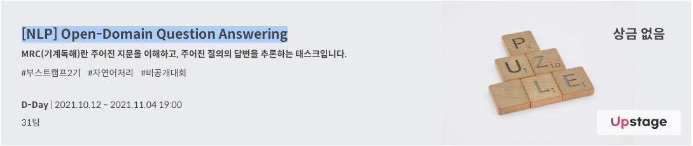
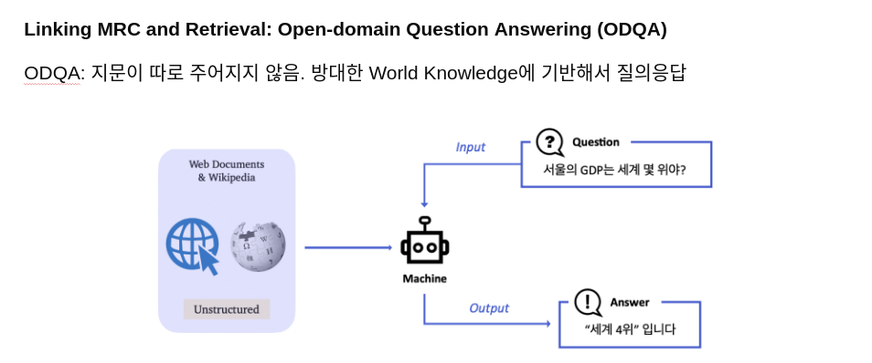
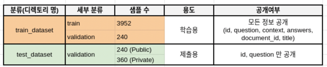

<div align="center">
  <h1>MRC Open-Domain Question Answering</h1>
</div>



<div align="center">
  

  
</div>

## :fire: Getting Started

### Data setting & Install Requirements

```
# data (51.2 MB)
tar -xzf data.tar.gz

# 필요한 파이썬 패키지 설치. 
bash ./install/install_requirements.sh
```

### Dependencies

```
datasets==1.5.0
elasticsearch==7.10.0
elastic-apm==6.6.0
huggingface-hub==0.0.19
numpy==1.19.2
pandas==1.1.4
transformers==4.11.3
tqdm==4.62.3
torch==1.7.1
tokenizers==0.10.3
```

### Contents

```bash
./code/assets/                  # readme 에 필요한 이미지 저장
./code/install/                 # 요구사항 설치 파일 
./code/model/                   # Additional custom model 파일
./code/arguments.py             # 실행되는 모든 argument가 dataclass 의 형태로 저장되어있음 
./code/combine.py               # k-fold 적용 후 soft voting 하는 코드 제공
./code/data_processing.py       # reader 모델을 위한 데이터 전처리 모듈 제공
./code/dense_retrieval.py       # dense retriever 모듈 제공
./code/retrieval.py             # sparse retreiver 모듈 제공
./code/elastic_search.py        # elastic search 모듈 제공
./code/prepare_dataset.py       # 데이터셋의 context 를 전처리하고 저장해주는 파일
./code/retrieval_train.py       # dense retrieval model 학습 
./code/retrieval_test.py        # retrieval (sparse, dense, elastic) top-k 에 따른 성능 비교
./code/train.py                 # MRC, Retrieval 모델 학습 및 평가 
./code/inference.py		        # ODQA 모델 평가 또는 제출 파일 (predictions.json) 생성
./code/trainer_qa.py            # MRC 모델 학습에 필요한 trainer 제공.
./code/utils_qa.py              # reader 모델 관련 유틸 함수 제공
./code/utils_retrieval.py       # retrieval 모델 관련 유틸 함수 제공 
./data/                         # 전체 데이터. 아래 상세 설명
./description/                  # baselie code 설명
```

## :mag: Overview

### Background

Question Answering (QA)은 다양한 종류의 질문에 대해 대답하는 인공지능을 만드는 연구 분야입니다. 
다양한 QA 시스템 중, Open-Domain Question Answering (ODQA) 은 주어지는 지문이 따로 존재하지 않고 사전에 구축되어있는 
Knowledge resource 에서 질문에 대답할 수 있는 문서를 찾는 과정이 추가되기 때문에 더 어려운 문제입니다.



본 ODQA 대회에서 우리가 만들 모델은 two-stage로 구성되어 있습니다. 
첫 단계는 질문에 관련된 문서를 찾아주는 "retriever" 단계이고, 다음으로는 관련된 문서를 읽고 적절한 답변을 찾거나 만들어주는 "reader" 단계입니다.

따라서, 대회는 더 정확한 답변을 내주는 모델을 만드는 팀이 좋은 성적을 거두게 됩니다.

### Problem definition
> 주어진 문장과 문장의 단어(subject entity, object entity)를 이용하여, <br>
> subject entity와 object entity가 어떤 관계가 있는지 예측하는 시스템 or 모델 구축하기

### Development environment
- GPU V100 원격 서버
- PyCharm 또는 Visual Studio Code | Python 3.8(or over)

### Evaluation
1. **Exact Match (EM)**: 모델의 예측과, 실제 답이 정확하게 일치할 때만 점수가 주어집니다. 즉 모든 질문은 0점 아니면 1점으로 처리됩니다. 단, 띄어쓰기나 "."과 같은 문자가 포함되어 있다고 오답으로 처리되면 억울하겠죠? 이런 것은 제외한 후 정답에 대해서만 일치하는지 확인합니다. 또한 답이 하나가 아닐 수 있는데, 이런 경우는 하나라도 일치하면 정답으로 간주합니다.


2. **F1 Score**: EM과 다르게 부분 점수를 제공합니다. 예를 들어, 정답은 "Barack Obama"지만 예측이 "Obama"일 때, EM의 경우 0점을 받겠지만 F1 Score는 겹치는 단어도 있는 것을 고려해 부분 점수를 받을 수 있습니다.


**EM 기준으로 리더보드 등수가 반영**되고, F1은 참고용으로만 활용됩니다.

## Dataset Preparation
### Data Information

아래는 제공하는 데이터셋의 분포를 보여줍니다.



데이터셋은 편의성을 위해 Huggingface 에서 제공하는 datasets를 이용하여 pyarrow 형식의 데이터로 저장되어있습니다. 다음은 데이터셋의 구성입니다.

### ./data structure

```python
./data/                        # 전체 데이터
    ./train_dataset/           # 학습에 사용할 데이터셋. train 과 validation 으로 구성 
    ./test_dataset/            # 제출에 사용될 데이터셋. validation 으로 구성 
    ./wikipedia_documents.json # 위키피디아 문서 집합. retrieval을 위해 쓰이는 corpus.
```

data에 대한 argument 는 `arguments.py` 의 `DataTrainingArguments` 에서 확인 가능합니다. 

### Prepare Images
학습을 위한 데이터셋의 구조 


open domain 데이터셋 구조


- train(train + validation): 총 4,192개
- test: 총 600개 
- wiki document(open domain) : 총 60,613

## :running: Training

```
# train 시(train, validate 할 때)
$ --do_train --do_eval 
```

### Train Retrieval Models
- [RoBERTa](https://arxiv.org/pdf/1907.11692.pdf)
  - klue/roberta-small(https://huggingface.co/klue/roberta-small)
- [BERT](https://arxiv.org/pdf/1810.04805.pdf)
  - klue/bert-base(https://huggingface.co/klue/bert-base)


### K-fold


```py 
from sklearn.model_selection import KFold
```

### Training Arguments
```
$ python train.py \
  --do_train \
  --project_name = {wandb project name} \
  --run_name = {wandb run name} \
  --model_name_or_path = {kinds of models} \
  --num_train_epochs = {epoch size} \
  --fold = {k-fold 사용 시 True, 아니면 False} \
```


## :thought_balloon: Inference
# train과 inference를 한 번에 실행 시
$ python train.py \
--do_train \
--project_name={output_dir} \
--run_name={output_dir} \
--additional_model={type_of_layer} \
--retrieval_type={type_of_retrieval} \
--top_k_retrieval={num_of_topk} \
--fold={num_fold}
```

```
# inference만 실행 시
$ python inference.py \
--do_predict \
--project_name={output_dir} \
--run_name={output_dir} \
--retrieval_type={type_of_retrieval} \
--top_k_retrieval={num_of_topk} \
--fold={num_fold}
```
